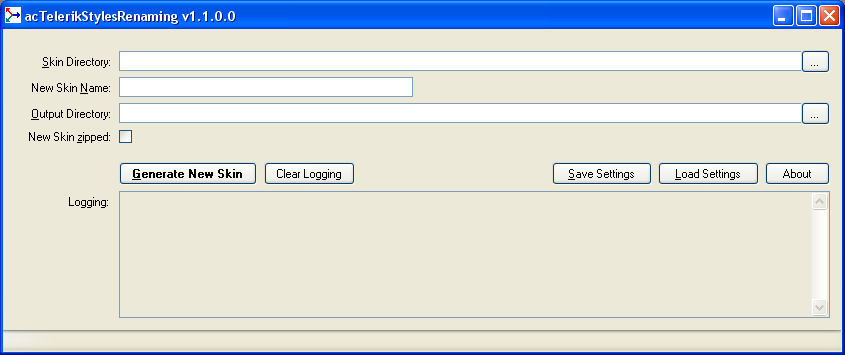

# acTelerikStylesRenaming

C# Application to create a new Telerik Skin by copying and renaming a base Telerik Skin. This application copies and renames all directories, sub directories and all accepted files including CSS file from the base Telerik Skin directory to the new one. In each CSS file, it replaces base Skin name with the new one (Lite version taken in account).

acTelerikStylesRenaming 
Copyright 2015 acDevSoftware

Useful links:
- [acTelerikStylesRenaming Windows installer](https://www.acdevsoftware.ch/Download/Default.aspx#TOOLS).

Follow us:
- on [LinkedIn](http://www.linkedin.com/company/acdevsoftware).
- on [Facebook](https://www.facebook.com/pages/Acdevsoftware/1375578242656685).
- on [Twitter](https://twitter.com/acdevsoftware).

## License

acTelerikStylesRenaming licensing given in [License](LICENSE).

## Screenshot

## Table of contents:

1. Dependencies.
2. Installation.
3. Usage.
4. Configuration of acTelerikStylesRenaming with acTelerikStylesRenaming.exe.config.
5. Compatibility with Telerik StyleBuilder application.
6. History.

### 1) Dependencies

acTelerikStylesRenaming needs:
- Framework .NET 4.x.
- Visual Studio 2010 or newer for compiling the source code.

### 2) Installation

Install the acTelerikStylesRenaming application with the installer and all is ready to use.

### 3) Usage

1. Launch acTelerikStylesRenaming.
2. Set the Skin Directory field to the Telerik Skin directory to be copied and renamed. 
   Example to copy Black Skin: 
   &emsp;C:\Program Files\Telerik\RadControls for ASP.NET AJAX Q2 2013\Skins\Black
3. Set the New Skin Name field to the new name (if the Skin Directory, point 2, is the Lite version, the new name is automatically appended with Lite word. 
   Example: 
   &emsp;MyBlack 
   Example with Lite: 
   &emsp;MyBlackLite
4. Set the Output Directory field to the directory where the new Skin will be created. 
   acTelerikStylesRenaming will create a sub directory containing the new Skin. 
   Example: 
   &emsp;C:\Temp will contain C:\Temp\MyBlack
5. Set New Skin Zipped to true to generate the zipped file of the new generated Skin. 
   This zipped Skin file can be used by our tool [acTelerikStylesAssembly](https://github.com/acDevSoftware/acTelerikStylesAssembly) or [Telerik StyleBuilder](http://stylebuilder.telerik.com) (see paragraph 5)
6. Click on the button "Generate New Skin" and if no error occurs, the new Telerik Skin is created from Skin Directory (point 2) into the Output Directory (point 4). 
   Example: 
   &emsp;C:\Temp\MyBlack
7. If New Skin Zipped was set to true, the new Telerik Skin is zipped with the new Skin Name appended with zip extension into the Output Directory (point 4).

### 4) Configuration of acTelerikStylesRenaming with acTelerikStylesRenaming.exe.config

1. Set TelerikSkinsPath setting to the path of the Telerik Skins directory and the Skin Directory field will be filled with this value at startup.
2. AssemblyCulture setting is not used currently.

### 5) Compatibility with Telerik StyleBuilder application

The current version of Telerik StyleBuilder (28.03.2013, http://stylebuilder.telerik.com) doesn't accept the generated zipped New Skin file (example with MyBlack) because RadAjax_MyBlack.css and RadAsyncUpload_MyBlack.css containing in this zipped file crash the StyleBuilder application (The same problem occurs if an original skin from Skins folder is zipped and loaded in StyleBuilder).

As a workaround, extract and remove the two files RadAjax_MyBlack.css and RadAsyncUpload_MyBlack.css from MyBlack.zip, load the NewSkin.zip in Telerik StyleBuilder and after saving it, put back the two extracted files RadAjax_MyBlack.css and RadAsyncUpload_MyBlack.css in MyBlack.zip.

### 6) History

1.0.0 (09.09.2013):

Initial release

1.1.0:

Fix:
- The Common Telerik Skins folder and all its contents was not copied into the Common folder of the new generated skin folder.

New:
- Added the possibility to zip the new generated Skin folder to be used directly by [acTelerikStylesAssembly](https://github.com/acDevSoftware/acTelerikStylesAssembly) or [Telerik StyleBuilder](http://stylebuilder.telerik.com) Web Application.
